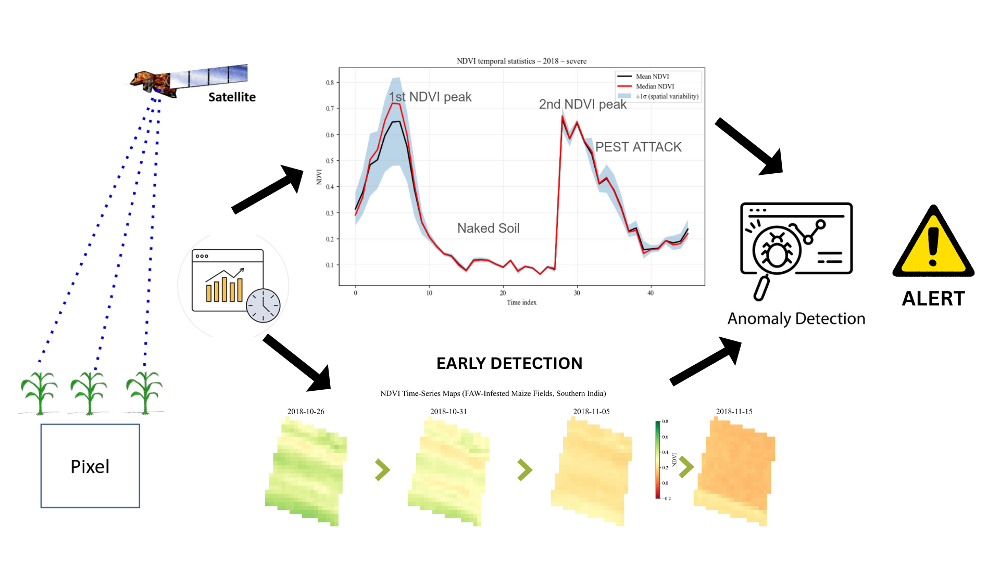

# Detecting Pest-Attacks in Agriculture using Satellite Data

This repository contains code implementations and methods for detecting anomalies in time-series Sentinel-2 satellite imagery. The goal of this project was to create a model that given a time-series of images generate early alerts of possible pest attacks for the farmer in three degress: Low, Medium, Severe.

The repository is structured based on different regions of the globe. In the `ghana.ipynb` we have the code to track down pest-attacks in Ejura, Ghana. In the `india.ipynb`, we have the code to track down pest-attacks in the Southern region of India. 

## Trading-Inspired Anomaly Detection Models

We apply trading-inspired circuit breaker concepts to agricultural monitoring. In financial trading, high volatility triggers circuit breakers at predefined thresholds:
- **Stage 1**: 10% price loss (30 min halt)
- **Stage 2**: 15% price loss (1 hour halt)
- **Stage 3**: >20% price loss (1 day halt)

### Agricultural Application

Similarly, we monitor NDVI (Normalized Difference Vegetation Index) for pest detection:
- **Stage 1**: 10% biomass loss alert
- **Stage 2**: 15% biomass loss alert
- **Stage 3**: >20% biomass loss alert

The rate of change is calculated as $\frac{\Delta NDVI}{\Delta T}$, where $\Delta T$ represents the time interval between observations (minimum 5 days).

We recommend computing derivatives at multiple intervals: 5, 10, 15, 20, 25, and 30 days.

### Limitations

Single-satellite data creates delays in anomaly detection, resulting in economic loss before alerts trigger. Multi-sensor data fusion is recommended to improve temporal resolution and reduce detection latency.